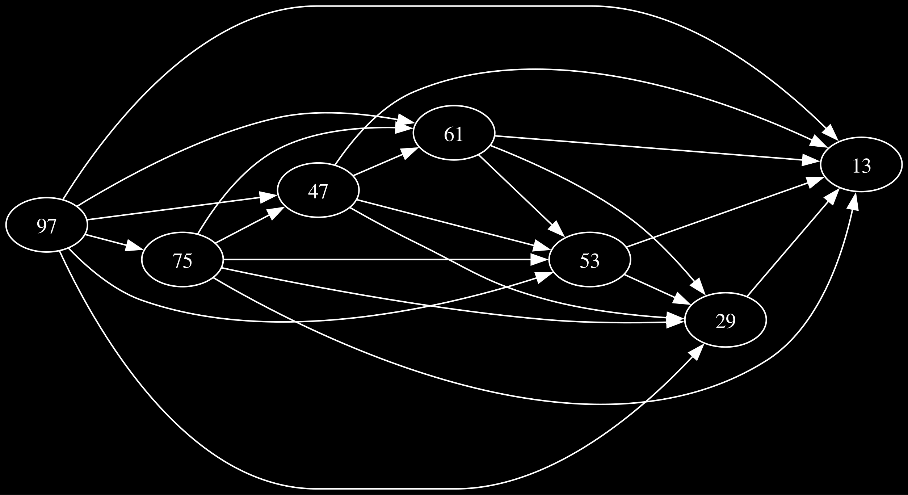
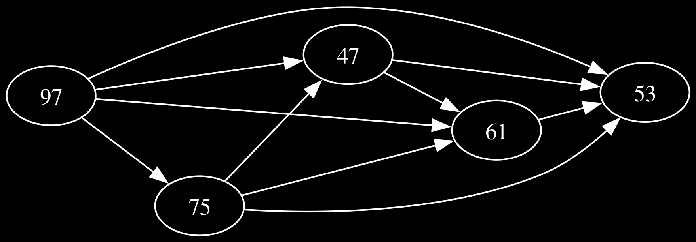

## Introduction

This post is about [Day 5](https://adventofcode.com/2024/day/5) of Advent of Code 2024. The problem involves ordering pages based on some rules and I ended up using a DAG for it, and the overall idea was interesting enough to write about.

## Problem Statement

We're presented with a scenario where a printer needs to print manual pages in a specific order. The input consists of two sections:

1. A list of rules in the format "X|Y", meaning page X must be printed before page Y
2. A series of updates, each containing a sequence of page numbers to be printed

Our task is two-fold:  
1. Identify which updates are already in the correct order.  
2. Fix the incorrect updates using the given rules.  

Here's a small example of the input:
```
╭────────────────╮
│47|53           │
│97|13           │
│97|61           │
│...             │
│                │
│75,47,61,53,29  │
│97,61,53,29,13  │
│75,29,13        │
│...             │
╰────────────────╯
```

## Solution Approach

### Part 1: Validating Page Orders

The first part is relatively straightforward. For each update sequence, we need to check if it satisfies all applicable rules. Let's break down how we can do this:

```
╭───────────────────────────────────────────────────────────────────────╮
│function IsValidOrder(update, rules):                                  │
│    // Create a set of all pages in this update                        │
│    update_pages = create set from update                              │
│                                                                       │
│    // Map each page to its position in the sequence                   │
│    positions = empty map                                              │
│    for i = 0 to length(update) - 1:                                   │
│        positions[update[i]] = i                                       │
│                                                                       │
│    // Check each rule                                                 │
│    for each rule in rules:                                            │
│        // Only check rules where both pages are in this update        │
│        if rule.before in update_pages AND rule.after in update_pages: │
│            // 'before' page must appear earlier than 'after' page     │
│            if positions[rule.before] >= positions[rule.after]:        │
│                return false                                           │
│                                                                       │
│    return true                                                        │
╰───────────────────────────────────────────────────────────────────────╯
```

<details>
<summary>Full process of validating an update sequence</summary>
<p>

Update sequence: [75, 47, 61, 53, 29]  
Pages in update: {75, 47, 61, 53, 29}  
Position map: {75: 0, 47: 1, 61: 2, 53: 3, 29: 4}  

Checking rules:

Rule 47|53:  
  47 at position 1  
  53 at position 3  
  ✓ Rule satisfied

Rule 75|29:  
  75 at position 0  
  29 at position 4  
  ✓ Rule satisfied

Rule 75|53:
  75 at position 0  
  53 at position 3  
  ✓ Rule satisfied  

Rule 53|29:  
  53 at position 3  
  29 at position 4  
  ✓ Rule satisfied  

Rule 61|53:  
  61 at position 2  
  53 at position 3  
  ✓ Rule satisfied  

Rule 61|29:  
  61 at position 2  
  29 at position 4  
  ✓ Rule satisfied  

Rule 75|47:  
  75 at position 0  
  47 at position 1  
  ✓ Rule satisfied  

Rule 47|61:  
  47 at position 1  
  61 at position 2  
  ✓ Rule satisfied  

Rule 75|61:  
  75 at position 0  
  61 at position 2  
  ✓ Rule satisfied  

Rule 47|29:  
  47 at position 1  
  29 at position 4  
  ✓ Rule satisfied  

✓ All rules satisfied</p>
</details>

### Part 2: Fixing Invalid Orders

The second part is where things get fun.

#### The Graph Theory Connection

Each rule "X|Y" can be seen as a directed edge in a graph where:
- Pages are nodes
- Rules are directed edges (X → Y)
- A valid order is a topological sort of this graph



For example, with an invalid update [75,97,47,61,53], we first build a graph of just these pages and their applicable rules:



#### Implementation: Topological Sort

We use Kahn's algorithm for topological sorting:

```
╭────────────────────────────────────────────────────╮
│L ← Empty list that will contain the sorted elements│
│S ← Set of all nodes with no incoming edge          │
│                                                    │
│while S is not empty do                             │
│    remove a node n from S                          │
│    add n to L                                      │
│    for each node m with an edge e from n to m do   │
│        remove edge e from the graph                │
│        if m has no other incoming edges then       │
│            insert m into S                         │
│                                                    │
│if graph has edges then                             │
│    return error   (graph has at least one cycle)   │
│else                                                │
│    return L   (a topologically sorted order)       │
╰────────────────────────────────────────────────────╯
```


<details>
<summary>Full process of fixing an invalid update</summary>
<p>

Invalid update: [75, 97, 47, 61, 53]

Topological Sort Process:  
Initial in-degrees: {97: 0, 75: 1, 47: 2, 53: 4, 61: 3}  
Initial graph: {47: [53, 61], 97: [61, 47, 53, 75], 75: [53, 47, 61], 61: [53]}

Queue: [97]  
Current result: []  
Processed 97 -> 61, new in-degree: 2  
Processed 97 -> 47, new in-degree: 1  
Processed 97 -> 53, new in-degree: 3  
Processed 97 -> 75, new in-degree: 0  

Queue: [75]  
Current result: [97]  
Processed 75 -> 53, new in-degree: 2  
Processed 75 -> 47, new in-degree: 0  
Processed 75 -> 61, new in-degree: 1  

Queue: [47]  
Current result: [97, 75]  
Processed 47 -> 53, new in-degree: 1  
Processed 47 -> 61, new in-degree: 0  

Queue: [61]
Current result: [97, 75, 47]
Processed 61 -> 53, new in-degree: 0

Queue: [53]  
Current result: [97, 75, 47, 61]  

Final order: [97, 75, 47, 61, 53]</p>
</details>

## Key Insights

1.**Problem Translation**: The key insight was recognizing this as a graph problem. The rules effectively define a directed acyclic graph (DAG) where edges represent ordering constraints.

2.**Solution Quality**: The topological sort ensures we get a valid ordering that respects all rules, and Kahn's algorithm is particularly nice because it tends to produce a "natural" ordering.


## Conclusion

This puzzle is a great example of how graph theory is very cool. Read [graph theory papers](https://dl.acm.org/doi/pdf/10.1145/368996.369025) when bored.