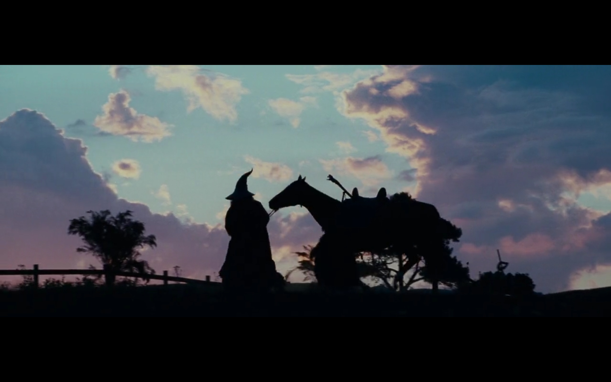

## Introduction

Hi, I'm Raj. I'm a junior at uni, pursuing a bachelor's in computer science
and engineering. This is my 23rd personal website, and I have yet to write 
a semi decent blog post.

## Experience

I've interned at [HAL](https://www.hal-india.co.in/home) as an RTOS and Frontend R&D trainee, working on improving data pipelines
for audio processing, and dev and bug fixes for playback software. I've picked
up freelance work in web and tui development, including consultancy for
site design and tooling. Open source is a big part of what I do, with contributions
for software in rust, bash etc. with a focus on algorithms and improving system documentation.

## Socials

- [Mail](mailto:typhoeusxoxo@gmail.com)
- [Letterboxd](https://letterboxd.com/thermitesinatra/)
- [LinkedIn](https://www.linkedin.com/in/raj-rajeshwar-singh/)

